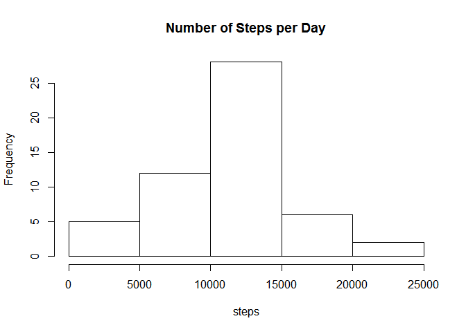
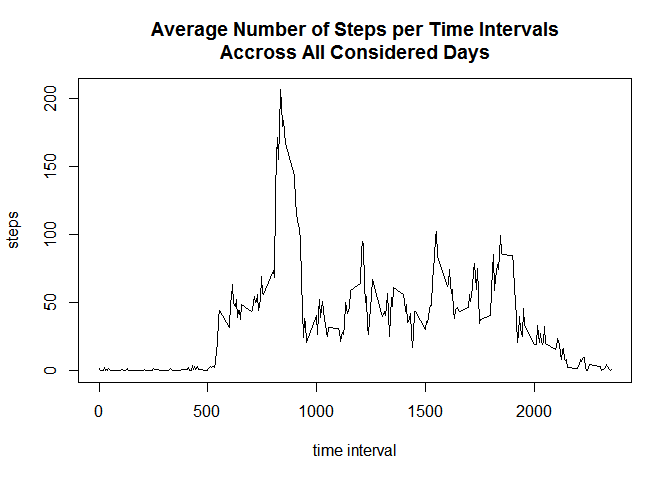

# Reproducible Research: Peer Assessment 1


## Loading and preprocessing

```r
data <- read.csv("C://Users//Marcio Vianna Filho//Dropbox//Coursera//Reproducible research//Assignment 1//RepData_PeerAssessment1//activity//activity.csv")
```


## What is mean total number of steps taken per day?
1. Histogram of steps taken each day

```r
agrData <- aggregate(data$steps, by=list(data$date), FUN=sum)
hist(agrData[,2], 
     main="Number of Steps per Day",
     xlab="steps")
```

 

2. Mean and median total number of steps taken per day

```r
avSteps <- mean(agrData[,2], na.rm=T)
medSteps <- median(agrData[,2], na.rm=T)
print(paste("The number of steps taken per day has an average of", avSteps, "and a median of", medSteps, "in the observed period."))
```

```
## [1] "The number of steps taken per day has an average of 10766.1886792453 and a median of 10765 in the observed period."
```


## What is the average daily activity pattern?
1. Make a time series plot (i.e. type = "l" ) of the 5-minute interval (x-axis)
and the average number of steps taken, averaged across all days (y-axis)

```r
agrData <- aggregate(data$steps, by=list(data$interval), FUN=mean, na.rm=T)
plot(agrData[,1], agrData[,2], type="l",
     main="Average Number of Steps per Time Intervals\nAccross All Considered Days",
     xlab="time interval",
     ylab="steps")
```

 

2. Which 5-minute interval, on average across all the days in the dataset,
contains the maximum number of steps?

```r
maxSteps <- max(agrData[,2])
interMaxsteps <- agrData[agrData[,2]==maxSteps,][,1]
print(paste("The interval with the maximum number of steps is on average interval", interMaxsteps, "with", maxSteps, "steps taken on average."))
```

```
## [1] "The interval with the maximum number of steps is on average interval 835 with 206.169811320755 steps taken on average."
```
## Imputing missing values


## Are there differences in activity patterns between weekdays and weekends?
